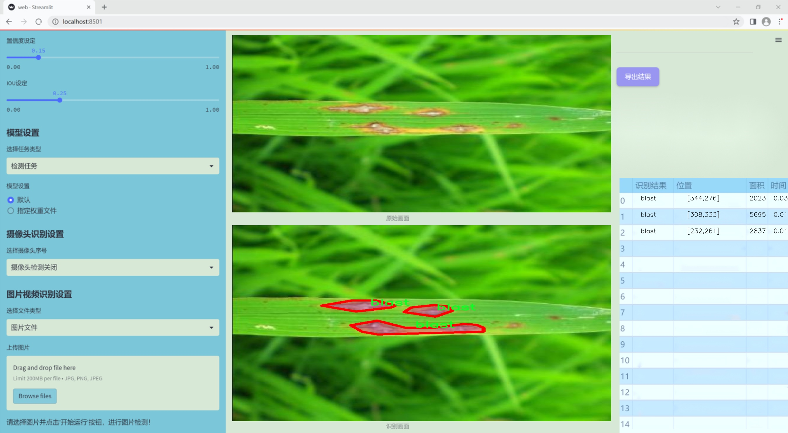
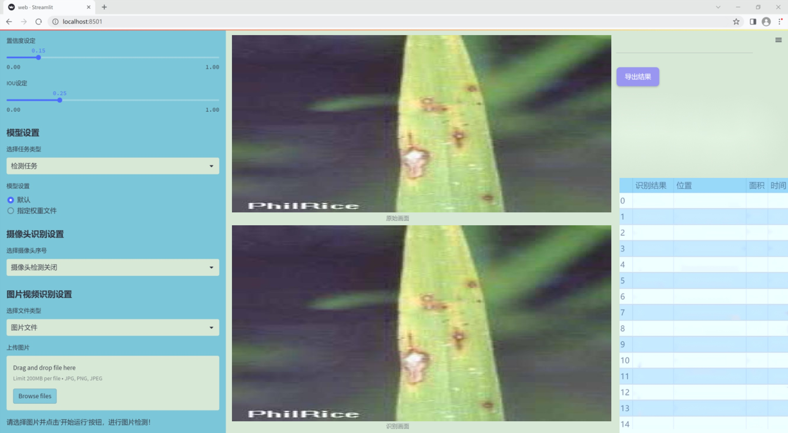
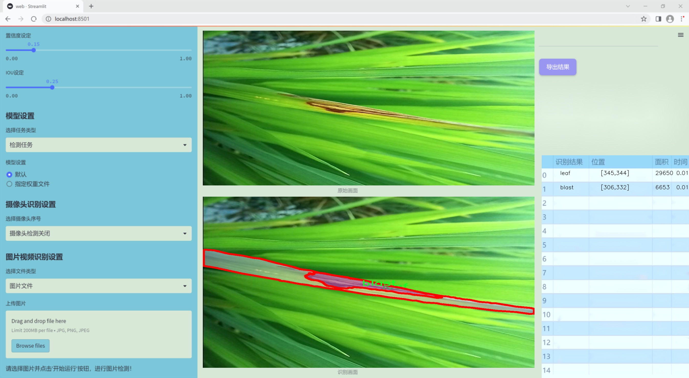
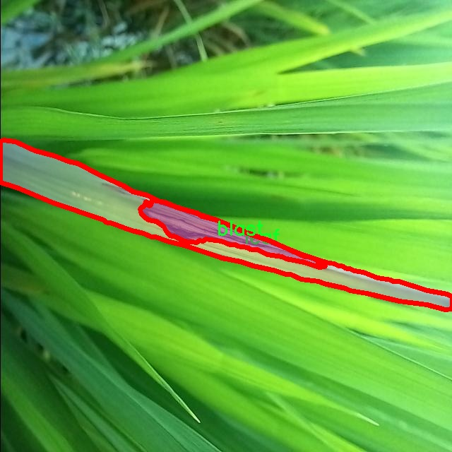
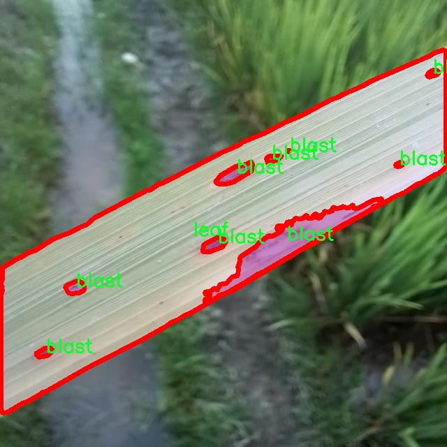
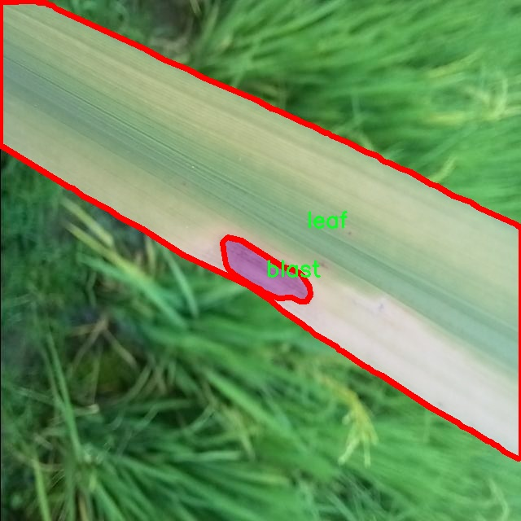
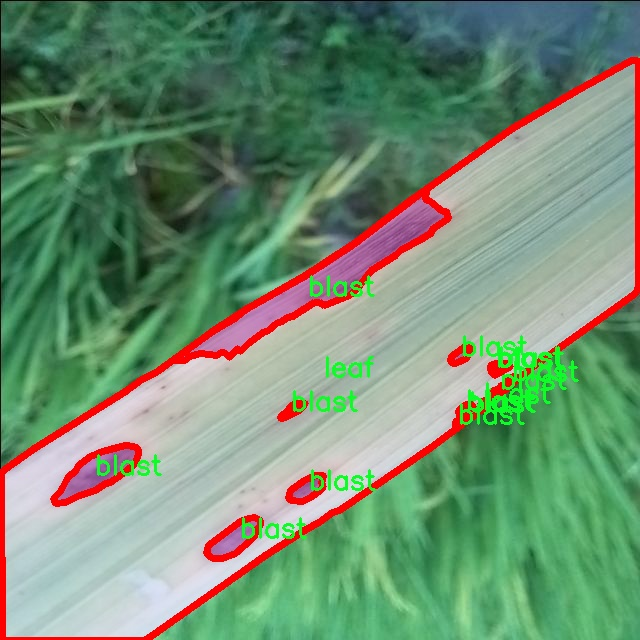
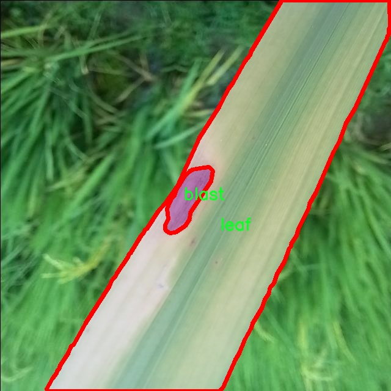

### 1.背景意义

研究背景与意义

水稻是全球范围内重要的粮食作物之一，尤其在亚洲地区，水稻不仅是主要的食物来源，也是农民生计的重要保障。然而，水稻在生长过程中容易受到多种病害的侵袭，其中水稻稻瘟病（blast）和叶斑病（leaf）是最为常见且危害严重的病害。这些病害不仅会导致水稻产量下降，还会影响水稻的品质，进而对农民的经济收入造成负面影响。因此，及时、准确地检测和识别水稻病害，对于保障粮食安全和提高农业生产效率具有重要的现实意义。

随着计算机视觉技术的迅速发展，基于深度学习的图像识别方法在农业病害检测中展现出了良好的应用前景。YOLO（You Only Look Once）系列模型因其高效的实时检测能力，已成为目标检测领域的主流方法之一。特别是YOLOv11的推出，进一步提升了检测精度和速度，为水稻病害的自动识别提供了新的技术手段。本研究旨在基于改进的YOLOv11模型，构建一个高效的水稻病害检测系统，以实现对稻瘟病和叶斑病的快速识别和分类。

本项目将利用一个包含5800张图像的数据集，数据集中涵盖了稻瘟病和叶斑病两个类别，经过精心标注，能够为模型的训练提供丰富的样本。通过对图像进行预处理和数据增强，提升模型的泛化能力，从而提高病害检测的准确性和鲁棒性。最终，该系统的应用将有助于农民及时发现和处理水稻病害，降低损失，提高水稻的产量和质量，为实现可持续农业发展贡献力量。

### 2.视频效果

[2.1 视频效果](https://www.bilibili.com/video/BV1KSkCYmExz/)

### 3.图片效果







##### [项目涉及的源码数据来源链接](https://kdocs.cn/l/cszuIiCKVNis)**

注意：本项目提供训练的数据集和训练教程,由于版本持续更新,暂不提供权重文件（best.pt）,请按照6.训练教程进行训练后实现上图演示的效果。

### 4.数据集信息

##### 4.1 本项目数据集类别数＆类别名

nc: 2
names: ['blast', 'leaf']


该项目为【图像分割】数据集，请在【训练教程和Web端加载模型教程（第三步）】这一步的时候按照【图像分割】部分的教程来训练

##### 4.2 本项目数据集信息介绍

本项目数据集信息介绍

本项目所使用的数据集专注于水稻病害检测，特别是针对水稻的“稻瘟病”及其叶片病害的评估。数据集的主题为“rice_blast_grade_assessment”，旨在为改进YOLOv11模型提供高质量的训练数据，以提高其在水稻病害识别方面的准确性和效率。该数据集包含两类主要的病害类型，分别为“blast”（稻瘟病）和“leaf”（叶片病害），总共涵盖了两种类别。这些类别的选择不仅反映了水稻在生长过程中常见的病害类型，也为模型的训练提供了丰富的样本。

在数据集的构建过程中，数据采集涵盖了不同生长阶段的水稻植株，确保了样本的多样性和代表性。每个类别的样本均经过精心标注，确保在训练过程中模型能够学习到有效的特征。稻瘟病和叶片病害的样本不仅包括不同病害程度的表现，还涵盖了不同环境条件下的表现，从而增强了模型的泛化能力。

此外，为了提高数据集的实用性，样本图像的拍摄角度、光照条件和背景环境均有所变化。这种多样化的样本设计使得模型在实际应用中能够更好地适应不同的农业环境，进而提高病害检测的准确性和可靠性。通过对该数据集的深入分析与应用，期望能够为水稻种植者提供更为高效的病害监测工具，进而推动农业生产的可持续发展。











### 5.全套项目环境部署视频教程（零基础手把手教学）

[5.1 所需软件PyCharm和Anaconda安装教程（第一步）](https://www.bilibili.com/video/BV1BoC1YCEKi/?spm_id_from=333.999.0.0&vd_source=bc9aec86d164b67a7004b996143742dc)


[5.2 安装Python虚拟环境创建和依赖库安装视频教程（第二步）](https://www.bilibili.com/video/BV1ZoC1YCEBw?spm_id_from=333.788.videopod.sections&vd_source=bc9aec86d164b67a7004b996143742dc)

### 6.改进YOLOv11训练教程和Web_UI前端加载模型教程（零基础手把手教学）

[6.1 改进YOLOv11训练教程和Web_UI前端加载模型教程（第三步）](https://www.bilibili.com/video/BV1BoC1YCEhR?spm_id_from=333.788.videopod.sections&vd_source=bc9aec86d164b67a7004b996143742dc)


按照上面的训练视频教程链接加载项目提供的数据集，运行train.py即可开始训练



     Epoch   gpu_mem       box       obj       cls    labels  img_size
     1/200     20.8G   0.01576   0.01955  0.007536        22      1280: 100%|██████████| 849/849 [14:42<00:00,  1.04s/it]
               Class     Images     Labels          P          R     mAP@.5 mAP@.5:.95: 100%|██████████| 213/213 [01:14<00:00,  2.87it/s]
                 all       3395      17314      0.994      0.957      0.0957      0.0843

     Epoch   gpu_mem       box       obj       cls    labels  img_size
     2/200     20.8G   0.01578   0.01923  0.007006        22      1280: 100%|██████████| 849/849 [14:44<00:00,  1.04s/it]
               Class     Images     Labels          P          R     mAP@.5 mAP@.5:.95: 100%|██████████| 213/213 [01:12<00:00,  2.95it/s]
                 all       3395      17314      0.996      0.956      0.0957      0.0845

     Epoch   gpu_mem       box       obj       cls    labels  img_size
     3/200     20.8G   0.01561    0.0191  0.006895        27      1280: 100%|██████████| 849/849 [10:56<00:00,  1.29it/s]
               Class     Images     Labels          P          R     mAP@.5 mAP@.5:.95: 100%|███████   | 187/213 [00:52<00:00,  4.04it/s]
                 all       3395      17314      0.996      0.957      0.0957      0.0845


###### [项目数据集下载链接](https://kdocs.cn/l/cszuIiCKVNis)

### 7.原始YOLOv11算法讲解

YOLOv11是一种由Ultralytics公司开发的最新一代目标检测模型，以其增强的特征提取能力和更高的效率在计算机视觉领域引人注目。该模型在架构上进行了关键升级，通过更新主干和颈部结构，显著提高了对复杂视觉场景的理解和处理精度。YOLOv11不仅在目标检测上表现出色，还支持实例分割、图像分类、姿态估计和定向目标检测（OBB）等任务，展示出其多功能性。

与其前身YOLOv8相比，YOLOv11在设计上实现了深度和宽度的改变，同时引入了几个创新机制。其中，C3k2机制是对YOLOv8中的C2f的改进，提升了浅层特征的处理能力；C2PSA机制则进一步优化了特征图的处理流程。解耦头的创新设计，通过增加两个深度卷积（DWConv），提高了模型对细节的感知能力和分类准确性。

在性能上，YOLOv11m模型在COCO数据集上的平均精度（mAP）提高，并减少了22%的参数量，确保了在运算效率上的突破。该模型可以部署在多种平台上，包括边缘设备、云平台以及支持NVIDIA GPU的系统，彰显出卓越的灵活性和适应性。总体而言，YOLOv11通过一系列的创新突破，对目标检测领域产生了深远的影响，并为未来的开发提供了新的研究方向。


****文档**** ： _ _https://docs.ultralytics.com/models/yolo11/__

****代码链接**** ： _ _https://github.com/ultralytics/ultralytics__

******Performance Metrics******


​ ** **关键特性****

****◆**** ** **增强的特征提取能力**** ：YOLO11采用了改进的主干和颈部架构，增强了 ** **特征提取****
能力，能够实现更精确的目标检测和复杂任务的执行。

****◆**** ** **优化的效率和速度****
：YOLO11引入了精细化的架构设计和优化的训练流程，提供更快的处理速度，并在准确性和性能之间保持最佳平衡。

****◆**** ** **参数更少、精度更高****
：通过模型设计的改进，YOLO11m在COCO数据集上实现了更高的平均精度（mAP），同时使用的参数比YOLOv8m少22%，使其在计算上更加高效，而不牺牲准确性。

****◆**** ** **跨环境的适应性**** ：YOLO11可以无缝部署在各种环境中，包括边缘设备、云平台和支持NVIDIA
GPU的系统，确保最大的灵活性。

****◆**** ** **支持广泛任务****
：无论是目标检测、实例分割、图像分类、姿态估计还是定向目标检测（OBB），YOLO11都旨在应对一系列计算机视觉挑战。

****支持的任务和模式****


​YOLO11建立在YOLOv8中引入的多功能模型范围之上，为各种计算机视觉任务提供增强的支持:


​该表提供了YOLO11模型变体的概述，展示了它们在特定任务中的适用性以及与Inference、Validation、Training和Export等操作模式的兼容性。从实时检测到复杂的分割任务
，这种灵活性使YOLO11适用于计算机视觉的广泛应用。

##### yolov11的创新

■ yolov8 VS yolov11

YOLOv5，YOLOv8和YOLOv11均是ultralytics公司的作品，ultralytics出品必属精品。


​ **具体创新点** ：

**① 深度（depth）和宽度 （width）**

YOLOv8和YOLOv11是基本上完全不同。

**② C3k2机制**

C3k2有参数为c3k，其中在网络的浅层c3k设置为False。C3k2就相当于YOLOv8中的C2f。


​ **③ C2PSA机制**

下图为C2PSA机制的原理图。


​ **④ 解耦头**

解耦头中的分类检测头增加了两个 **DWConv** 。


▲Conv

    
    
    def autopad(k, p=None, d=1):  # kernel, padding, dilation
    
        """Pad to 'same' shape outputs."""
    
        if d > 1:
    
            k = d * (k - 1) + 1 if isinstance(k, int) else [d * (x - 1) + 1 for x in k]  # actual kernel-size
    
        if p is None:
    
            p = k // 2 if isinstance(k, int) else [x // 2 for x in k]  # auto-pad
    
    return p
    
    
    class Conv(nn.Module):
    
        """Standard convolution with args(ch_in, ch_out, kernel, stride, padding, groups, dilation, activation)."""
    
    
        default_act = nn.SiLU()  # default activation
    
    
        def __init__(self, c1, c2, k=1, s=1, p=None, g=1, d=1, act=True):
    
            """Initialize Conv layer with given arguments including activation."""
    
            super().__init__()
    
            self.conv = nn.Conv2d(c1, c2, k, s, autopad(k, p, d), groups=g, dilation=d, bias=False)
    
            self.bn = nn.BatchNorm2d(c2)
    
            self.act = self.default_act if act is True else act if isinstance(act, nn.Module) else nn.Identity()
    
    
        def forward(self, x):
    
            """Apply convolution, batch normalization and activation to input tensor."""
    
            return self.act(self.bn(self.conv(x)))
    
    
        def forward_fuse(self, x):
    
            """Perform transposed convolution of 2D data."""
    
            return self.act(self.conv(x))

▲Conv2d

    
    
    torch.nn.Conv2d(in_channels, out_channels, kernel_size, stride=1, padding=0, dilation=1, groups=1, bias=True, padding_mode='zeros')

▲DWConv

DWConv ** **代表 Depthwise Convolution（深度卷积）****
，是一种在卷积神经网络中常用的高效卷积操作。它主要用于减少计算复杂度和参数量。

    
    
    class DWConv(Conv):
    
        """Depth-wise convolution."""
    
    
        def __init__(self, c1, c2, k=1, s=1, d=1, act=True):  # ch_in, ch_out, kernel, stride, dilation, activation
    
            """Initialize Depth-wise convolution with given parameters."""
    
            super().__init__(c1, c2, k, s, g=math.gcd(c1, c2), d=d, act=act)


### 8.200+种全套改进YOLOV11创新点原理讲解

#### 8.1 200+种全套改进YOLOV11创新点原理讲解大全

由于篇幅限制，每个创新点的具体原理讲解就不全部展开，具体见下列网址中的改进模块对应项目的技术原理博客网址【Blog】（创新点均为模块化搭建，原理适配YOLOv5~YOLOv11等各种版本）

[改进模块技术原理博客【Blog】网址链接](https://gitee.com/qunmasj/good)


#### 8.2 精选部分改进YOLOV11创新点原理讲解

###### 这里节选部分改进创新点展开原理讲解(完整的改进原理见上图和[改进模块技术原理博客链接](https://gitee.com/qunmasj/good)【如果此小节的图加载失败可以通过CSDN或者Github搜索该博客的标题访问原始博客，原始博客图片显示正常】
### 全维动态卷积ODConv
鉴于上述讨论，我们的ODConv引入了一种多维注意机制，该机制具有并行策略，用于学习卷积核在核空间的所有四个维度上的不同注意。图提供了CondConv、DyConv和ODConv的示意性比较。

ODConv的公式：根据等式1中的符号，ODConv可定义为


 将注意力标量分配给整个卷积核。图2示出了将这四种类型的关注乘以n个卷积核的过程。原则上，这四种类型的关注是相互补充的，并且以位置、信道、滤波器和核的顺序将它们逐步乘以卷积核 
 ，使得卷积运算不同w.r.t.所有空间位置、所有输入信道、所有滤波器和输入x的所有核，提供捕获丰富上下文线索的性能保证。因此，ODConv可以显著增强CNN基本卷积运算的特征提取能力。此外，具有单个卷积核的ODConv可以与标准CondConv和DyConv竞争或优于它们，为最终模型引入的额外参数大大减少。提供了大量实验来验证这些优点。通过比较等式1和等式2，我们可以清楚地看到，ODConv是一种更广义的动态卷积。此外，当设置n=1且 所有分量均为1时，只关注滤波器方向 的ODConv将减少为：将基于输入特征的SE变量应用于卷积滤波器，然后进行卷积运算（注意原始SE（Hu等人，2018b）基于输出特征，并且用于重新校准输出特征本身）。这种SE变体是ODConv的特例。


图：将ODConv中的四种注意类型逐步乘以卷积核的示例。（a） 沿空间维度的逐位置乘法运算，（b）沿输入信道维度的逐信道乘法运算、（c）沿输出信道维度的按滤波器乘法运算，以及（d）沿卷积核空间的核维度的按核乘法运算。方法部分对符号进行了说明
实现：对于ODConv，一个关键问题是如何计算卷积核的四种关注度 。继CondConv和DyConv之后，我们还使用SE型注意力模块（Hu等人，2018b），但将多个头部作为来计算它们，其结构如图所示。具体而言，首先通过逐通道全局平均池（GAP）运算将输入压缩到具有长度的特征向量中。随后，存在完全连接（FC）层和四个头部分支。ReLU（Krizhevsky等人，2012）位于FC层之后。FC层将压缩特征向量映射到具有缩减比的低维空间（根据消融实验，我们在所有主要实验中设置 ，避免了高模型复杂度）。对于四个头部分支，每个分支都有一个输出大小如图。

### 引入ODConv的改进YOLO
参考这篇博客涵盖了引入ODConv的改进YOLOv11系统的内容，ODConv采用多维注意机制，在卷积核空间的四个维度上学习不同的注意。结合了CondConv和DyConv的优势，ODConv通过图示的四种注意类型逐步与卷积核相乘，以捕获丰富的上下文线索，提升特征提取能力。

#### ODConv结构与方法
ODConv的公式和图示展示了其关注力分配给卷积核的方式，其中四种类型的关注以位置、信道、滤波器和核的顺序逐步与卷积核相乘。这种结构保证了卷积运算不同于标准的Conv操作，能够捕获更多上下文信息，从而增强了CNN的特征提取能力。另外，单个卷积核的ODConv在性能上能够与CondConv和DyConv相竞争，并且引入的额外参数大幅减少。

ODConv的特殊之处在于其广义的动态卷积性质，同时在特定条件下（n=1且所有分量为1），它可以退化为一种特例，即只关注滤波器方向，这类似于基于输入特征的SE变体，但不同于原始SE，它基于输出特征。

#### ODConv的实现
关键问题在于如何计算卷积核的四种关注度。ODConv采用了SE型注意力模块，结合了多个头部来计算这些关注度。具体实现上，通过逐通道全局平均池运算和完全连接层，将输入压缩为特征向量，随后使用四个头部分支来计算四种不同类型的关注。这样的结构能在保持模型复杂度可控的情况下，提升了特征的表征能力。

ODConv的引入为YOLOv11带来了显著的性能提升，并且通过大量实验证明了其在特征提取方面的优越性。其结合了多维注意机制和卷积操作，为目标检测和分拣系统的提升带来了新的思路和性能突破。


### 9.系统功能展示

图9.1.系统支持检测结果表格显示

  图9.2.系统支持置信度和IOU阈值手动调节

  图9.3.系统支持自定义加载权重文件best.pt(需要你通过步骤5中训练获得)

  图9.4.系统支持摄像头实时识别

  图9.5.系统支持图片识别

  图9.6.系统支持视频识别

  图9.7.系统支持识别结果文件自动保存

  图9.8.系统支持Excel导出检测结果数据


### 10. YOLOv11核心改进源码讲解

#### 10.1 prepbn.py

以下是经过简化和注释的核心代码部分：

```python
import torch
import torch.nn as nn

# 自定义的批量归一化层，包含一个可学习的参数 alpha
class RepBN(nn.Module):
    def __init__(self, channels):
        super(RepBN, self).__init__()
        # 初始化可学习参数 alpha，初始值为 1
        self.alpha = nn.Parameter(torch.ones(1))
        # 初始化 1D 批量归一化层
        self.bn = nn.BatchNorm1d(channels)

    def forward(self, x):
        # 将输入张量的维度进行转置，以适应 BatchNorm 的输入格式
        x = x.transpose(1, 2)
        # 进行批量归一化，并加上 alpha 乘以原始输入
        x = self.bn(x) + self.alpha * x
        # 再次转置回原来的维度
        x = x.transpose(1, 2)
        return x


# 自定义的线性归一化层，支持两种归一化方式的线性组合
class LinearNorm(nn.Module):
    def __init__(self, dim, norm1, norm2, warm=0, step=300000, r0=1.0):
        super(LinearNorm, self).__init__()
        # 注册一些缓冲区变量，用于控制训练过程中的参数
        self.register_buffer('warm', torch.tensor(warm))  # 预热阶段的计数
        self.register_buffer('iter', torch.tensor(step))  # 当前迭代次数
        self.register_buffer('total_step', torch.tensor(step))  # 总迭代次数
        self.r0 = r0  # 初始比例
        # 初始化两种归一化方式
        self.norm1 = norm1(dim)
        self.norm2 = norm2(dim)

    def forward(self, x):
        if self.training:  # 如果处于训练模式
            if self.warm > 0:  # 如果仍在预热阶段
                self.warm.copy_(self.warm - 1)  # 递减预热计数
                x = self.norm1(x)  # 仅使用 norm1 进行归一化
            else:
                # 计算当前的比例 lamda
                lamda = self.r0 * self.iter / self.total_step
                if self.iter > 0:
                    self.iter.copy_(self.iter - 1)  # 递减迭代计数
                # 分别使用两种归一化方式
                x1 = self.norm1(x)
                x2 = self.norm2(x)
                # 按照 lamda 比例线性组合两种归一化结果
                x = lamda * x1 + (1 - lamda) * x2
        else:
            # 如果处于评估模式，直接使用 norm2 进行归一化
            x = self.norm2(x)
        return x
```

### 代码说明：
1. **RepBN 类**：
   - 该类实现了一个自定义的批量归一化层，除了标准的批量归一化操作外，还引入了一个可学习的参数 `alpha`，用于调整输入特征的影响。

2. **LinearNorm 类**：
   - 该类实现了一个线性归一化层，支持在训练过程中动态调整使用的归一化方式。它根据预热阶段和迭代次数来决定使用哪种归一化方式的组合。
   - 在训练初期（预热阶段），只使用 `norm1` 进行归一化；在预热结束后，根据当前迭代次数和总迭代次数计算一个比例 `lamda`，用于线性组合 `norm1` 和 `norm2` 的输出。

这个程序文件`prepbn.py`定义了两个神经网络模块，分别是`RepBN`和`LinearNorm`，它们都继承自PyTorch的`nn.Module`类。

首先，`RepBN`类是一个自定义的批量归一化模块。它的构造函数接受一个参数`channels`，表示输入数据的通道数。在构造函数中，首先调用父类的构造函数，然后定义了一个可学习的参数`alpha`，初始值为1，并创建了一个标准的1维批量归一化层`bn`。在前向传播方法`forward`中，输入张量`x`的维度被转置，以适应批量归一化的要求。接着，经过批量归一化处理后，输出结果与`alpha`乘以原始输入相加，最后再将结果转置回原来的维度并返回。这种设计使得网络在进行批量归一化的同时，还能保留原始输入的特征，通过`alpha`参数的学习来调节两者的权重。

接下来是`LinearNorm`类，它实现了一种线性归一化的机制。构造函数接受多个参数，包括`dim`（维度）、`norm1`和`norm2`（分别是两种归一化方法的类），以及`warm`（预热步数）、`step`（迭代步数）和`r0`（初始比例因子）。在构造函数中，使用`register_buffer`方法注册了一些常量，这些常量在模型训练时不会被视为模型参数。`forward`方法中包含了训练和推理两种模式的处理逻辑。在训练模式下，如果还有预热步数，则使用第一种归一化方法`norm1`处理输入；否则，计算一个动态的比例因子`lamda`，并根据当前的迭代步数决定使用哪种归一化方法。最终的输出是这两种归一化结果的加权和。在推理模式下，直接使用第二种归一化方法`norm2`处理输入。

总体来看，这个文件中的模块设计灵活，能够在不同的训练阶段动态调整归一化策略，旨在提高模型的训练效果和性能。

#### 10.2 wtconv2d.py

以下是代码中最核心的部分，并附上详细的中文注释：

```python
import torch
import torch.nn as nn
import torch.nn.functional as F
from torch.autograd import Function
import pywt

# 创建小波滤波器
def create_wavelet_filter(wave, in_size, out_size, type=torch.float):
    # 使用PyWavelets库创建小波对象
    w = pywt.Wavelet(wave)
    
    # 反转小波的高通和低通滤波器
    dec_hi = torch.tensor(w.dec_hi[::-1], dtype=type)
    dec_lo = torch.tensor(w.dec_lo[::-1], dtype=type)
    
    # 创建分解滤波器
    dec_filters = torch.stack([
        dec_lo.unsqueeze(0) * dec_lo.unsqueeze(1),
        dec_lo.unsqueeze(0) * dec_hi.unsqueeze(1),
        dec_hi.unsqueeze(0) * dec_lo.unsqueeze(1),
        dec_hi.unsqueeze(0) * dec_hi.unsqueeze(1)
    ], dim=0)

    # 扩展滤波器以适应输入通道数
    dec_filters = dec_filters[:, None].repeat(in_size, 1, 1, 1)

    # 反转小波的重构滤波器
    rec_hi = torch.tensor(w.rec_hi[::-1], dtype=type).flip(dims=[0])
    rec_lo = torch.tensor(w.rec_lo[::-1], dtype=type).flip(dims=[0])
    
    # 创建重构滤波器
    rec_filters = torch.stack([
        rec_lo.unsqueeze(0) * rec_lo.unsqueeze(1),
        rec_lo.unsqueeze(0) * rec_hi.unsqueeze(1),
        rec_hi.unsqueeze(0) * rec_lo.unsqueeze(1),
        rec_hi.unsqueeze(0) * rec_hi.unsqueeze(1)
    ], dim=0)

    # 扩展滤波器以适应输出通道数
    rec_filters = rec_filters[:, None].repeat(out_size, 1, 1, 1)

    return dec_filters, rec_filters

# 小波变换
def wavelet_transform(x, filters):
    b, c, h, w = x.shape  # 获取输入的形状
    pad = (filters.shape[2] // 2 - 1, filters.shape[3] // 2 - 1)  # 计算填充
    # 使用小波滤波器进行卷积
    x = F.conv2d(x, filters.to(x.dtype).to(x.device), stride=2, groups=c, padding=pad)
    x = x.reshape(b, c, 4, h // 2, w // 2)  # 重新调整形状
    return x

# 逆小波变换
def inverse_wavelet_transform(x, filters):
    b, c, _, h_half, w_half = x.shape  # 获取输入的形状
    pad = (filters.shape[2] // 2 - 1, filters.shape[3] // 2 - 1)  # 计算填充
    x = x.reshape(b, c * 4, h_half, w_half)  # 重新调整形状
    # 使用小波滤波器进行转置卷积
    x = F.conv_transpose2d(x, filters.to(x.dtype).to(x.device), stride=2, groups=c, padding=pad)
    return x

# 定义小波变换的类
class WaveletTransform(Function):
    @staticmethod
    def forward(ctx, input, filters):
        ctx.filters = filters  # 保存滤波器
        with torch.no_grad():
            x = wavelet_transform(input, filters)  # 执行小波变换
        return x

    @staticmethod
    def backward(ctx, grad_output):
        grad = inverse_wavelet_transform(grad_output, ctx.filters)  # 计算梯度
        return grad, None

# 定义逆小波变换的类
class InverseWaveletTransform(Function):
    @staticmethod
    def forward(ctx, input, filters):
        ctx.filters = filters  # 保存滤波器
        with torch.no_grad():
            x = inverse_wavelet_transform(input, filters)  # 执行逆小波变换
        return x

    @staticmethod
    def backward(ctx, grad_output):
        grad = wavelet_transform(grad_output, ctx.filters)  # 计算梯度
        return grad, None

# 定义小波卷积层
class WTConv2d(nn.Module):
    def __init__(self, in_channels, out_channels, kernel_size=5, stride=1, bias=True, wt_levels=1, wt_type='db1'):
        super(WTConv2d, self).__init__()

        assert in_channels == out_channels  # 输入通道数和输出通道数必须相等

        self.in_channels = in_channels
        self.wt_levels = wt_levels
        self.stride = stride

        # 创建小波滤波器
        self.wt_filter, self.iwt_filter = create_wavelet_filter(wt_type, in_channels, in_channels, torch.float)
        self.wt_filter = nn.Parameter(self.wt_filter, requires_grad=False)  # 不需要训练的小波滤波器
        self.iwt_filter = nn.Parameter(self.iwt_filter, requires_grad=False)  # 不需要训练的逆小波滤波器
        
        # 初始化小波变换和逆小波变换的函数
        self.wt_function = wavelet_transform_init(self.wt_filter)
        self.iwt_function = inverse_wavelet_transform_init(self.iwt_filter)

        # 基础卷积层
        self.base_conv = nn.Conv2d(in_channels, in_channels, kernel_size, padding='same', stride=1, groups=in_channels, bias=bias)

        # 小波卷积层
        self.wavelet_convs = nn.ModuleList(
            [nn.Conv2d(in_channels*4, in_channels*4, kernel_size, padding='same', stride=1, groups=in_channels*4, bias=False) for _ in range(self.wt_levels)]
        )

    def forward(self, x):
        # 前向传播过程
        x_ll_in_levels = []  # 存储低频分量
        x_h_in_levels = []   # 存储高频分量

        curr_x_ll = x  # 当前低频分量

        for i in range(self.wt_levels):
            curr_x = self.wt_function(curr_x_ll)  # 执行小波变换
            curr_x_ll = curr_x[:,:,0,:,:]  # 更新低频分量
            
            # 处理高频分量
            curr_x_h = curr_x[:,:,1:4,:,:]
            x_ll_in_levels.append(curr_x_ll)
            x_h_in_levels.append(curr_x_h)

        # 逆小波变换
        next_x_ll = 0
        for i in range(self.wt_levels-1, -1, -1):
            curr_x_ll = x_ll_in_levels.pop()
            curr_x_h = x_h_in_levels.pop()
            curr_x = torch.cat([curr_x_ll.unsqueeze(2), curr_x_h], dim=2)  # 合并低频和高频分量
            next_x_ll = self.iwt_function(curr_x)  # 执行逆小波变换

        x = self.base_conv(x) + next_x_ll  # 添加基础卷积的输出
        return x
```

### 代码核心部分说明：
1. **小波滤波器的创建**：`create_wavelet_filter` 函数用于生成小波变换和逆变换所需的滤波器。
2. **小波变换和逆变换**：`wavelet_transform` 和 `inverse_wavelet_transform` 函数分别实现小波变换和逆变换的具体操作。
3. **自定义的自动求导功能**：`WaveletTransform` 和 `InverseWaveletTransform` 类继承自 `Function`，实现了前向和反向传播的逻辑。
4. **小波卷积层**：`WTConv2d` 类是一个卷积层，结合了小波变换的特性，能够在卷积过程中同时处理低频和高频信息。

这个程序文件 `wtconv2d.py` 实现了一个基于小波变换的二维卷积层，主要用于图像处理和特征提取。文件中使用了 PyTorch 框架，并结合了小波变换的数学原理，提供了对输入图像的多层次分解和重构功能。

首先，文件导入了必要的库，包括 PyTorch 的核心库和小波变换库 `pywt`。接着，定义了一个 `create_wavelet_filter` 函数，该函数根据指定的小波类型生成小波变换和逆小波变换所需的滤波器。滤波器的生成过程包括反转小波的分解和重构系数，并通过张量操作构建出滤波器。

接下来，定义了 `wavelet_transform` 和 `inverse_wavelet_transform` 函数，分别用于执行小波变换和逆小波变换。这两个函数利用卷积操作实现对输入数据的变换，支持对多个通道的处理。

在小波变换的实现中，使用了 PyTorch 的 `Function` 类来定义前向和反向传播的操作。`WaveletTransform` 和 `InverseWaveletTransform` 类分别实现了小波变换和逆变换的具体逻辑。在前向传播中，调用相应的变换函数，而在反向传播中，则计算梯度并返回。

随后，定义了 `WTConv2d` 类，继承自 `nn.Module`，这是实现小波卷积的核心类。在初始化方法中，设置了输入输出通道数、卷积核大小、步幅等参数，并生成小波滤波器。该类还定义了多个卷积层和缩放模块，用于处理不同层次的小波特征。

在 `forward` 方法中，首先对输入进行小波变换，并将结果分为低频和高频部分。然后，逐层处理这些特征，最后通过逆小波变换将特征重构回原始空间。重构后的特征与基础卷积层的输出相加，形成最终的输出。

最后，定义了一个 `_ScaleModule` 类，用于对输入进行缩放操作。该模块通过学习得到的参数对输入进行加权，增强模型的灵活性。

整体来看，这个程序文件实现了一个复杂的卷积层，结合了小波变换的优势，能够有效地提取图像中的多尺度特征，并提供了灵活的前向和反向传播机制，适用于深度学习中的图像处理任务。

#### 10.3 TransNext.py

以下是经过简化并添加详细中文注释的核心代码部分：

```python
try:
    # 尝试导入swattention模块和TransNext_cuda中的所有内容
    import swattention
    from ultralytics.nn.backbone.TransNeXt.TransNext_cuda import *
except ImportError as e:
    # 如果导入失败（例如swattention模块不存在），则导入TransNext_native中的所有内容
    from ultralytics.nn.backbone.TransNeXt.TransNext_native import *
    pass  # 继续执行后续代码，不做任何处理
```

### 代码说明：
1. **导入模块**：
   - 首先尝试导入`swattention`模块，这可能是一个用于实现注意力机制的库。
   - 然后从`ultralytics.nn.backbone.TransNeXt`路径下导入`TransNext_cuda`中的所有内容，这通常是一个基于CUDA的实现，适合在支持GPU的环境中运行。

2. **异常处理**：
   - 如果在导入过程中发生`ImportError`（例如，`swattention`模块未安装），则进入`except`块。
   - 在`except`块中，导入`TransNext_native`中的所有内容，这通常是一个不依赖CUDA的实现，适合在不支持GPU的环境中运行。

3. **`pass`语句**：
   - `pass`语句表示在捕获到异常后不执行任何操作，继续执行后续代码。这是一个占位符，表示在这里不需要做任何处理。

这种结构确保了代码在不同环境下的灵活性，能够根据可用的库和硬件条件选择合适的实现。

这个程序文件名为 `TransNext.py`，其主要功能是导入与 `TransNeXt` 相关的模块。代码的结构采用了 `try-except` 语句，目的是为了处理可能出现的导入错误。

首先，程序尝试从 `swattention` 模块中导入 `TransNext_cuda`。这个模块可能是针对 CUDA 加速的实现，适用于支持 GPU 的环境，以提高计算性能。如果导入成功，程序将继续执行后续的代码（虽然在这段代码中没有显示后续内容）。

如果在导入 `TransNext_cuda` 时发生 `ImportError`，程序会进入 `except` 块。在这个块中，程序会尝试导入 `TransNext_native` 模块。这个模块可能是一个不依赖于 CUDA 的实现，适用于不支持 GPU 的环境。通过这种方式，程序能够在不同的运行环境中灵活选择合适的模块，从而提高了代码的兼容性和可移植性。

总的来说，这段代码的设计考虑到了不同硬件环境的需求，确保在无法使用 CUDA 的情况下，仍然能够正常运行程序。

#### 10.4 rmt.py

以下是经过简化和注释的核心代码部分：

```python
import torch
import torch.nn as nn
import torch.nn.functional as F

class DWConv2d(nn.Module):
    """ 深度可分离卷积类 """
    def __init__(self, dim, kernel_size, stride, padding):
        super().__init__()
        # 使用 groups=dim 实现深度可分离卷积
        self.conv = nn.Conv2d(dim, dim, kernel_size, stride, padding, groups=dim)

    def forward(self, x: torch.Tensor):
        """ 前向传播函数
        x: 输入张量，形状为 (b, h, w, c)
        """
        x = x.permute(0, 3, 1, 2)  # 转换为 (b, c, h, w)
        x = self.conv(x)            # 卷积操作
        x = x.permute(0, 2, 3, 1)  # 转换回 (b, h, w, c)
        return x

class MaSA(nn.Module):
    """ 多头自注意力机制类 """
    def __init__(self, embed_dim, num_heads, value_factor=1):
        super().__init__()
        self.factor = value_factor
        self.embed_dim = embed_dim
        self.num_heads = num_heads
        self.head_dim = self.embed_dim * self.factor // num_heads
        self.key_dim = self.embed_dim // num_heads
        self.scaling = self.key_dim ** -0.5
        
        # 线性变换层
        self.q_proj = nn.Linear(embed_dim, embed_dim, bias=True)
        self.k_proj = nn.Linear(embed_dim, embed_dim, bias=True)
        self.v_proj = nn.Linear(embed_dim, embed_dim * self.factor, bias=True)
        self.out_proj = nn.Linear(embed_dim * self.factor, embed_dim, bias=True)

    def forward(self, x: torch.Tensor, rel_pos):
        """ 前向传播函数
        x: 输入张量，形状为 (b, h, w, c)
        rel_pos: 位置关系矩阵
        """
        bsz, h, w, _ = x.size()
        q = self.q_proj(x)  # 计算查询
        k = self.k_proj(x)  # 计算键
        v = self.v_proj(x)  # 计算值

        # 计算注意力权重
        qk_mat = (q @ k.transpose(-1, -2)) * self.scaling + rel_pos
        qk_mat = torch.softmax(qk_mat, dim=-1)  # 归一化

        # 计算输出
        output = (qk_mat @ v)
        output = self.out_proj(output)  # 最终线性变换
        return output

class FeedForwardNetwork(nn.Module):
    """ 前馈神经网络类 """
    def __init__(self, embed_dim, ffn_dim, activation_fn=F.gelu, dropout=0.0):
        super().__init__()
        self.fc1 = nn.Linear(embed_dim, ffn_dim)  # 第一层线性变换
        self.fc2 = nn.Linear(ffn_dim, embed_dim)  # 第二层线性变换
        self.dropout = nn.Dropout(dropout)  # Dropout层
        self.activation_fn = activation_fn  # 激活函数

    def forward(self, x: torch.Tensor):
        """ 前向传播函数
        x: 输入张量，形状为 (b, h, w, c)
        """
        x = self.fc1(x)  # 线性变换
        x = self.activation_fn(x)  # 激活
        x = self.dropout(x)  # Dropout
        x = self.fc2(x)  # 线性变换
        return x

class VisRetNet(nn.Module):
    """ 视觉恢复网络类 """
    def __init__(self, in_chans=3, num_classes=1000, embed_dims=[96, 192, 384, 768], depths=[2, 2, 6, 2], num_heads=[3, 6, 12, 24]):
        super().__init__()
        self.patch_embed = PatchEmbed(in_chans=in_chans, embed_dim=embed_dims[0])  # 图像分块嵌入
        self.layers = nn.ModuleList()  # 存储各层

        # 构建各层
        for i_layer in range(len(depths)):
            layer = BasicLayer(embed_dim=embed_dims[i_layer], depth=depths[i_layer], num_heads=num_heads[i_layer])
            self.layers.append(layer)

    def forward(self, x):
        """ 前向传播函数
        x: 输入张量，形状为 (b, c, h, w)
        """
        x = self.patch_embed(x)  # 图像嵌入
        for layer in self.layers:
            x = layer(x)  # 逐层处理
        return x

# 示例模型创建
def RMT_T():
    model = VisRetNet(
        embed_dims=[64, 128, 256, 512],
        depths=[2, 2, 8, 2],
        num_heads=[4, 4, 8, 16]
    )
    return model

if __name__ == '__main__':
    model = RMT_T()  # 创建模型
    inputs = torch.randn((1, 3, 640, 640))  # 随机输入
    res = model(inputs)  # 前向传播
    print(res.size())  # 输出结果尺寸
```

### 代码说明：
1. **DWConv2d**: 实现深度可分离卷积，适用于处理特征图。
2. **MaSA**: 实现多头自注意力机制，计算输入的注意力权重并生成输出。
3. **FeedForwardNetwork**: 实现前馈神经网络，包含两个线性层和激活函数。
4. **VisRetNet**: 视觉恢复网络，包含图像分块嵌入和多个基本层。
5. **RMT_T**: 创建一个小型的视觉恢复网络模型示例。

这段代码展示了一个视觉模型的核心组件，使用了深度学习中的自注意力机制和前馈网络结构。

这个程序文件 `rmt.py` 实现了一个基于视觉变换器（Vision Transformer）的深度学习模型，名为 VisRetNet。该模型通过多种模块和层来处理输入图像，进行特征提取和分类。以下是对代码的详细说明。

首先，文件导入了必要的库，包括 PyTorch 和一些辅助模块。接着，定义了一些基本的神经网络组件，如 `DWConv2d`、`RelPos2d`、`MaSAd`、`MaSA`、`FeedForwardNetwork`、`RetBlock`、`PatchMerging`、`BasicLayer`、`LayerNorm2d` 和 `PatchEmbed`。

`DWConv2d` 是一个深度可分离卷积层，用于处理输入特征图的空间信息。`RelPos2d` 用于生成二维相对位置编码，帮助模型理解输入数据的空间关系。`MaSAd` 和 `MaSA` 是多头自注意力机制的实现，分别支持不同的注意力计算方式。`FeedForwardNetwork` 实现了前馈神经网络，用于进一步处理特征。

`RetBlock` 是一个残差块，结合了注意力机制和前馈网络，并可以选择性地应用层归一化和层缩放。`PatchMerging` 用于将输入特征图的补丁合并，减少特征图的尺寸。`BasicLayer` 代表了模型的基本层，包含多个残差块和可能的下采样操作。

`LayerNorm2d` 是一个二维层归一化层，适用于处理图像数据。`PatchEmbed` 则将输入图像分割成多个补丁，并将其嵌入到高维空间中。

`VisRetNet` 是模型的主类，负责将各个层组合在一起。它的构造函数接收多个参数，定义了嵌入维度、层数、头数等超参数。模型通过 `patch_embed` 将输入图像转换为补丁，然后通过多个层进行处理，最终输出特征。

在文件的最后部分，定义了几个函数 `RMT_T`、`RMT_S`、`RMT_B` 和 `RMT_L`，这些函数分别创建不同规模的 VisRetNet 模型。每个函数都指定了不同的嵌入维度、深度、头数等参数，以适应不同的应用场景。

最后，程序的主入口部分创建了一个小型模型 `RMT_T`，并对随机生成的输入数据进行前向传播，输出特征图的尺寸。这部分代码用于测试模型的构建和功能。

总体来说，这个程序实现了一个复杂的视觉变换器模型，结合了多种先进的技术，如自注意力机制、深度可分离卷积和残差连接，适用于图像分类等任务。

### 11.完整训练+Web前端界面+200+种全套创新点源码、数据集获取


# [下载链接：https://mbd.pub/o/bread/Z5ybm5ps](https://mbd.pub/o/bread/Z5ybm5ps)